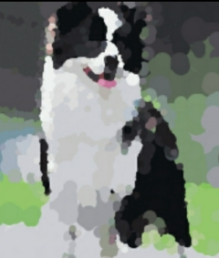

  

<!-- 

<a href="https://www.bilibili.com/video/BV1za4y1e7U9/">视频演示</a> | 
<a href="https://www.youtube.com/watch?v=3nDGifbqdug">Video presentation</a>

 -->

    Picture processing tools like compressing pictures, adding watermarks, etc ,it support batch processing.

    
  
  
  
  

 

    Learn more: <a href="https://github.com/shgopher" target="_blank">shgopher</a>

## 开发方式

#### 测试环境
go run .

#### 打包 linux 环境
go build . 
#### 打包 windows 环境
CGO_ENABLED=0 GOOS=windows GOARCH=amd64 go build . 

### 下载地址
[download binary file](https://github.com/liushuai05/photoZip/releases/)

### 如何使用

-n int
是否输出跟源文件相同的名称，0：是，1：不是，如果不是，系统会给出一个随机代码，默认是输出相同的名字

-o string
输出的路径 (default ".")

-q int
输出的照片质量，范围是从1 - 100 (default 75)

-r string
指定的输入路径，路径是指的图片所处的文件夹，文件夹中还有文件夹不影响，系统会找到你指定文件夹中的所以照片，包括文件夹中的文件夹里的图片 (default "./test")

-w int
输出的照片尺寸，0是跟之前一样大，单位是px

> 如果权限不足，记得改权限 `chmod +x ./photoZip`
- 用 windows 打开windows的命令行这样使用： ` photoZip.exe -r [your resource path] -o [your out put path] -q [the quality]`

- Mac和Linux： `photoZip -r resource path -o output path`

支持 png jpg jpeg and gif ,所有格式都按照jpeg来输出，所以GIF最好别用。因为输出的是第一张图
## HERE

## Stargazers over time

